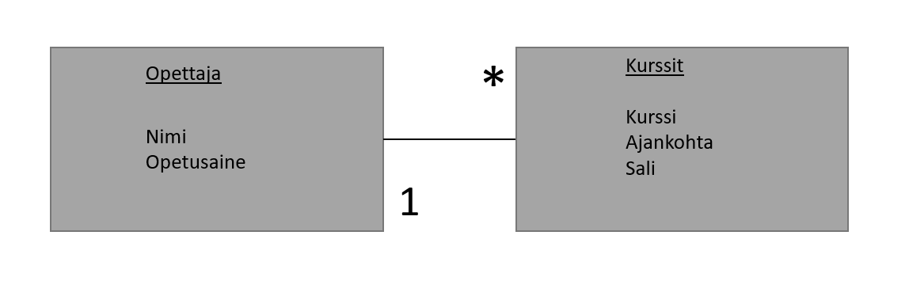

# SQL Tehtävät
### Tehtävä 1
Nimelläni löytyy Oscar ja Oskar nimisiä. Nimellä Matti tulee Mathiasta ja Maija nimellä löytyy Maja nimisiä.

### Tehtävä 2
Olen syöttänyt sähköpostini todella moneen eri palveluun, nimeä ja sukunimeä taas en erityisen moneen.
### Tehtävä 3

### Tehtävä 4
SELECT * FROM Kurssisuoritus

### Tehtävä 5
SELECT kurssi FROM Kurssisuoritus

### Tehtävä 6
SELECT DISTINCT kurssi FROM Kurssisuoritus

### Tehtävä 7
SELECT * FROM Opiskelija WHERE nimi='Anna'

### Tehtävä 8
SELECT * FROM Kurssisuoritus WHERE opiskelija='999999'

### Tehtävä 9
SELECT * FROM Opiskelija WHERE pääaine NOT LIKE '%tiede%'

### Tehtävä 10
SELECT nimi, päivämäärä, arvosana FROM Kurssi, Kurssisuoritus WHERE Kurssi.kurssitunnus = Kurssisuoritus.kurssi

### Tehtävä 11
SELECT nimi, päivämäärä, arvosana FROM Opiskelija, Kurssisuoritus WHERE Opiskelija.opiskelijanumero = Kurssisuoritus.opiskelija

### Tehtävä 12
SELECT Kurssi.nimi AS kurssi, Tehtävä.nimi AS tehtävä FROM Kurssi, Tehtävä, Kurssitehtävä WHERE Kurssi.kurssitunnus = Kurssitehtävä.kurssi AND Kurssitehtävä.tehtävä = Tehtävä.tunnus

### Tehtävä 13
SELECT Kurssi.nimi AS kurssi, Tehtävä.nimi AS tehtävä FROM Kurssi, Kurssitehtävä, Tehtävä, Tehtäväsuoritus, Opiskelija WHERE Opiskelija.nimi ='Anna' AND Kurssi.kurssitunnus = Kurssitehtävä.kurssi AND Tehtävä.tunnus = Kurssitehtävä.tehtävä AND Tehtäväsuoritus.tehtävä = Kurssitehtävä.tunnus AND Tehtäväsuoritus.opiskelija = Opiskelija.opiskelijanumero

### Tehtävä 14
neljäs ja viides rivi ovat suoritettuja tehtäviä

### Tehtävä 15

### Tehtävä 16

### Tehtävä 17

### Tehtävä 18

### Tehtävä 19

### Tehtävä 20

